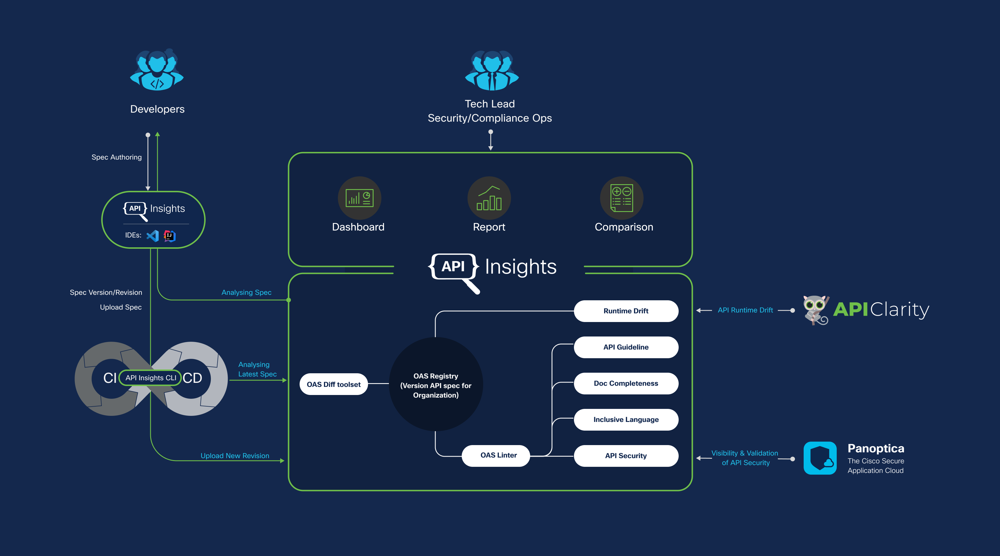

# API Insights
[API Insights](https://developer.cisco.com/site/api-insights/) is a tool to enable organizations to manage versioned API specifications (Swagger2/Open API Spec-3) for services. It also does static analysis of API spec files for compliance against REST API best practices guidelines, documents completeness, inclusive language check and runtime API drift from documented spec. To help API consumers and developers, API Insights service  also supports generating API change-log including identification of backward compatibility breaking change between 2 version of API spec files.

## API Specifications Challenges

- As number of service increases, no common place for storing versioned API specs.
- Inconsistency in API specifications across teams. Make it difficult for API consumers that integrate across multiple APIs.
- API changes across version could result in breaking backward compatibilities.
- Lack of consistent documentation of API changes across multiple releases.

## Solution

- API Insights service that enables storing of multiple versions of released (& release-candidate) of API specification .
- Validate & Score API Spec against guidelines:   
   - [API Insights REST guidelines](https://developer.cisco.com/docs/api-insights/#!rest-guidelines-ruleset)
       - Guidelines are tested using **[API guidelines linter](https://github.com/cisco-developer/api-insights-openapi-rulesets)**
   - [API Document completeness](https://developer.cisco.com/docs/api-insights/#!documentation-completeness-ruleset)
   - [Inclusive Language Ruleset](https://github.com/cisco-open/inclusive-language)  
   - API Drift analyzer (Integrate with [APIClarity](https://apiclarity.io) to identify Zombie and Shadow APIs)
   - API Security analyzer (*Future*: Integrate with [Panoptica](https://panoptica.app/) to enable API Security analyzer)

- API spec diff across multiple version/revision
  - Identify and alert on backward compatibility breaking changes.
  - API Insights CLI to enable runnning spec analyzer as part of API spec CICD or local commit pipleline.


## User flow and Architecture


API Insights user flow
- Developer or Tech Lead Can upload the API Specification and subsequent revisions: ​
  - Commit new version/revision of spec in github repository
  - CICD pipeline with analyze specs against guidelines & generate report/score.
  - On github release tag new version/revision of spec will be upload registry by CICD task.
  - Multiple products/services API specs can be managed in registry.  
- On new spec upload & preconfigure analysers will run on spec in back ground
- User can go API Insights UI to view
  - Analyser score and issue listing with trends across releases.
  - The user can click on view details to get a detailed report with severity, line number and remediation recommendations.
- Users will be able to see a summary of all API the changes (New, modified, Removed & Breaking) and will be able to see the details spec diff by clicking on each changed item.​
- Integration with APIClarity & Panoptica will allow:​
  - Security and Compliance users to get reports on Zombie & Shadow APIs​
  - Reconstructed OAPI for missing specs
  - Security Analysis of API

## Related Projects  and resources
- [API Insights VSCode Extension](https://github.com/cisco-developer/api-insights-extension-vscode)
- [API Insights OpenAPI Ruleset](https://github.com/cisco-developer/api-insights-openapi-rulesets)
- [Inclusive Language Ruleset](https://github.com/cisco-open/inclusive-language)
- [API Insights site](https://developer.cisco.com/site/api-insights/)
- [API Insights Doc](https://developer.cisco.com/docs/api-insights)


## Getting Started
This repo contains a helm based deployer that can be deployed in local kubernetes cluster setup using like Rancher desktop, minikube etc. The detailed instructions are found [here](https://developer.cisco.com/docs/api-insights/#!getting-started-with-an-api-insights-service).

## Development setup
Build and start UI & backend services using docker-compose
```
docker-compose up 
````
One docker-compose is up UI and be access at http://localhost:8080

- To run API service natively outside docker refer [api/README.md](api/README.md) 
- To run UI natively outside docker refer [ui/README.md](ui/README.md)

**Note**: If need to install docker-compose, install [Rancher Desktop](https://rancherdesktop.io/) or licensed 'Docker Desktop'

## Contribution

We welcome contributions please find details in [CONTRIBUTING.md](CONTRIBUTING.md)
